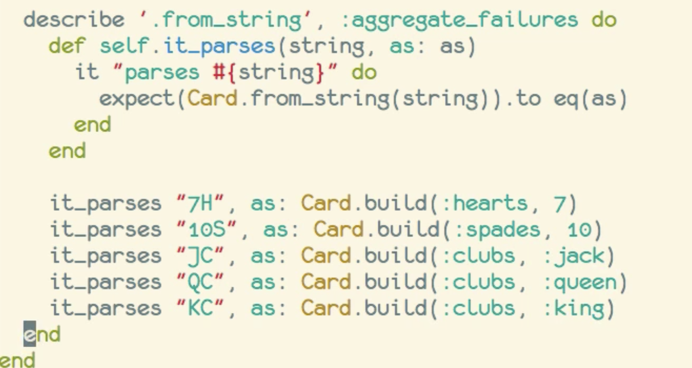

## RSpec testing

### mantras

Test for behavior not implementation
Test for confidence, not proof
Specs should only change when the behavior under test changes

## Handy helps

Rspec automatically knows about `lib/` and `spec/`
No need to indicate `spec/` when running `be rspec` since Rspec assumes it's there.

### dotfiles

put preferred config flags in .dotfile

*.rspec-local* (it's in project but should be ignored)
*.rspec*
*~/.rspec*


## HTML Output

```
  be rspec --format html --color spec > rspec_results.html
```

## Compact specifications
- helper methods
- shared examples
- let


## shared examples

use the `shared_examples_for` method and give it a description on the block...

```
  shared_examples_for 'equality' do
    # put similar code in here
  end
```

then to use it by calling `it_behaves_like 'equality'` and that will call those same examples inside the `it`


## Let and subject

`subject` is equalt to `let(:subject)`


## aliases

`context` is an alias for `describe`

`example` is an alias for `it`

## hooks

before(:each)
before(:all)
after(:each)
after(:all)

## matchers

### all

notice you can combine matchers, like `all` with `be`

expect([code example].each {||}).to all(be >= 7)


### have_attributes

This example nests three matchers inside one another;

expect([code example].each {||}).to all(have_attributes(rank: be >= 7))

## custom matchers

to create custom matchers, you extend the global namespace. Let's say we wanted to have a `be_red` matcher. then we'd write


1. define the module name
2. extend the DSL
3. use the `matcher` method
4. include matcher in specs

## aggregate_failures

wrap similar expectations into same example

```
  it 'does same thing' do
    aggregate_failures do
    expect(a).toBe(b)
    expect(b).toBe(c)
    expect(c).toBe(d)
    end
  end
```

or put that into the meta data if just want all to fail similar

`describe 'same thing', :aggregate_failures `

## compact tests

a nice way to use a helper method to make redundant tests more compact...



## boolean composition matchers

`.or`

`.and`

## Mocks

Mocks drive Code not the other way around!
Code should not drive mocks.

Mocks are a design tool, not a testing tool

deck = instance_double(Class)
expect(deck).to_receive(:deal).and_return([exact data])
